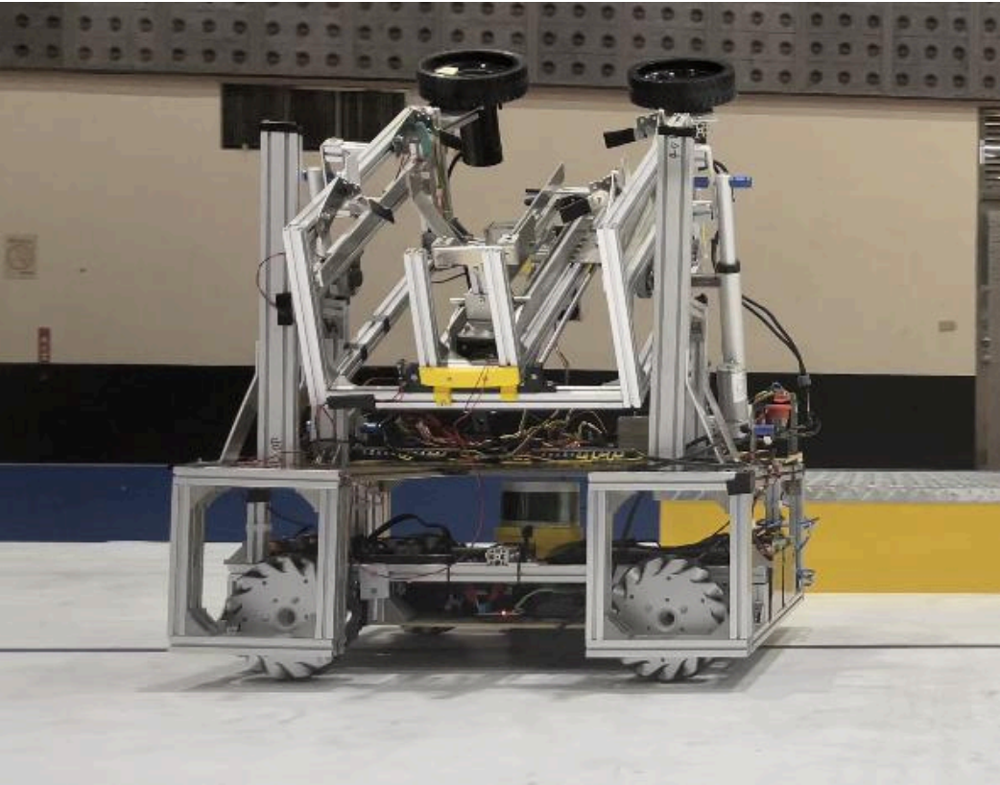
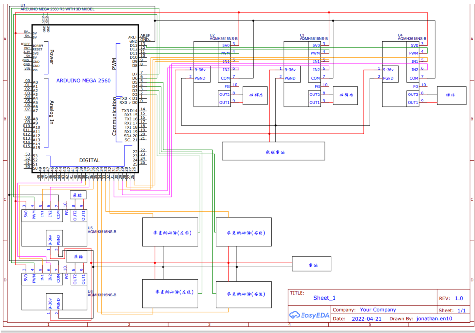
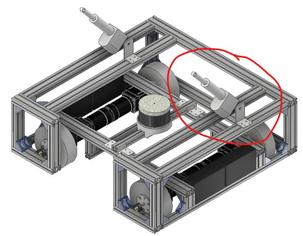
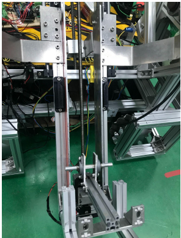
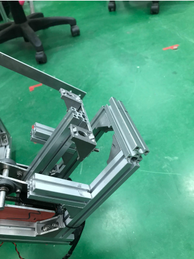
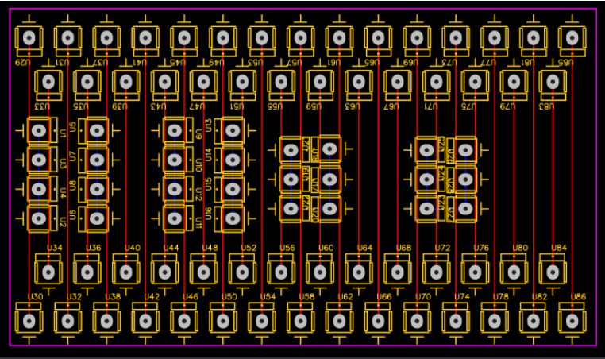
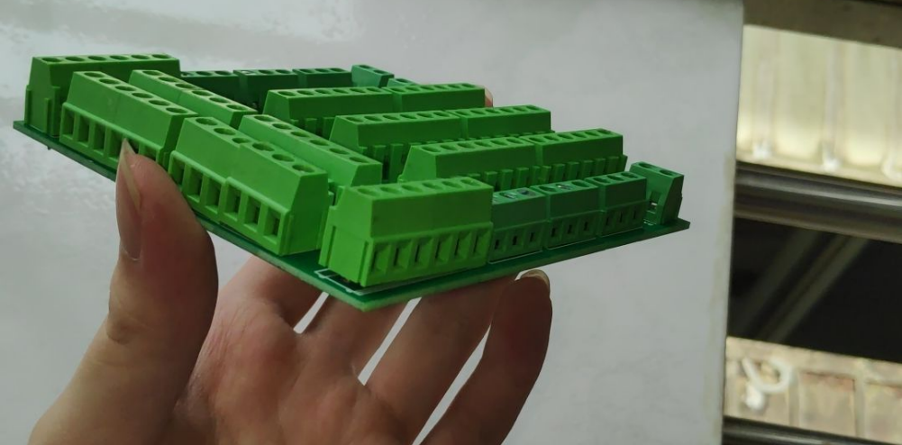
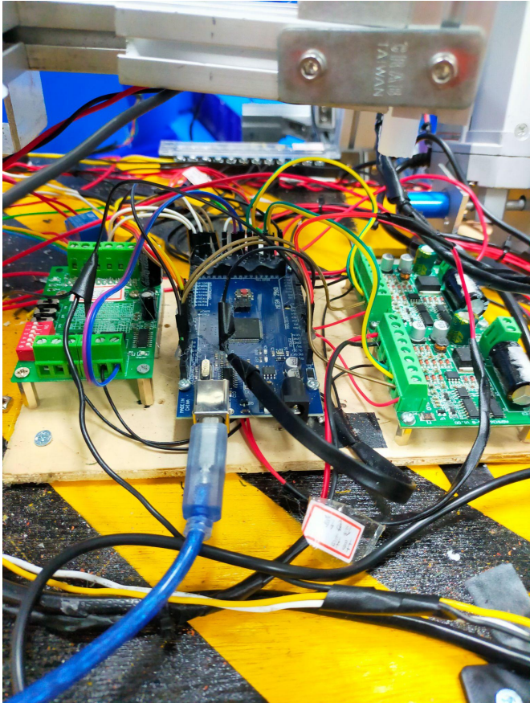

# Autonomous Basketball and Bowling Vehicle

An autonomous vehicle that fetches basketballs and bowling balls from ball racks, and launches them. This project is based on rules and requirements from 26th TDK Robocon - Autonomous Category.

This project received an **Honorable Mention** in *26th TDK Robocon - Autonomous Category*.

Official rules of the competition here:

[第 26 屆 TDK 盃全國大專校院創思設計與製作競賽 【自動組】競賽規則](https://tdk.stust.edu.tw/upload/news/files/26th%20TDK%E7%9B%83%E8%87%AA%E5%8B%95%E7%B5%84%E7%AB%B6%E8%B3%BD%E8%A6%8F%E5%89%87.pdf)

## Overview

- Built a Mecanum wheel chassis with projectile launching mechanism
- Developed autonomous navigation using lidar and Hector SLAM algorithm
- Used OpenCV-based image recognition system to detect the correct goal

## Demo

- [Competition Livestream (4-5 min)](https://www.youtube.com/live/0pQ_8PcyLhU?si=xLWl63fD6gH7JzC8&t=3719): Our vehicle on the right pane
  - [Highlight (1 min)](https://www.youtube.com/live/0pQ_8PcyLhU?si=w4PLQcwNdSIjKqLF&t=3791)

## Technical Highlights

- **Control System**:
  - Arduino for basic control logic
  - Intel NUC computer for navigation and image recognition
- **ROS**:
  - Node graph (Each box represents a node):

    - `dot_recognize`: Braille sign recognition
    - `alphabet_recognize`: Optical character recognition using OpenCV
    - `color_detect`: Color detection of the ball
    - `main_control`: Task scheduling
    - `navigation`: Navigation using hector slam
    - `upper_mechanism`: An interface to send commands to arduino (responsible for the control of the upper part)
    - `motor_control`: An interface to send commands to arduino (responsible for the control of the chassis)
- **Circuit**:
  - Circuit Diagram drawn using EasyEDA
  - 

## Gallery

<table>
  <tr>
	<td>Chassis</td>
	<td>Ball storage mechanism</td>
  </tr>
  <tr>
    <td></td>
    <td></td>
  </tr>
  <tr>
	<td>Ball fetching part</td>
	<td>Customized circuit board</td>
  </tr>
  <tr>
    <td></td>
	<td></td>
  </tr>
  <tr>
	<td>Completed circuit board</td>
	<td>Upper mechanism circuit</td>
  </tr>
  <tr>
    <td></td>
	<td></td>
  </tr>
</table>

## Authors

| Student (Dept./Year)                                        | Responsibilities                                                                                                                              |     Allocation (%) |
| ----------------------------------------------------------- | --------------------------------------------------------------------------------------------------------------------------------------------- | --------: |
| Ou, O Wei — Mechanical Engineering, Junior     | Chassis navigation; HectorSLAM; monocular camera distance-estimation model implementation; PID tuning; report writing & consolidation | 25.1% |
| Lin, O You — Mechanical Engineering, Sophomore    | Alphabet recognition; monocular distance-estimation model implementation; fixing scanning skew/tilt issues; color recognition             | 22.4% |
| Lin, O Qi — Mechanical Engineering, Junior     | Chassis control (incl. communication); motor log visualization; PID tuning; report writing & consolidation                                | 20.0% |
| **Wu, Dian-Mou — Mechanical Engineering, Sophomore**    | **Alphabet recognition; task controller; report writing & consolidation**                                                                         | **20.0%** |
| You, O Qi — Mechanical Engineering, Junior      | Braille recognition                                                                                                                       |  7.8% |
| Wang, O Zhe — Mechanical Engineering, Sophomore | Alphabet recognition; Braille recognition                                                                                                 |  4.7% |

> Some members' names not fully displayed due to privacy reasons.